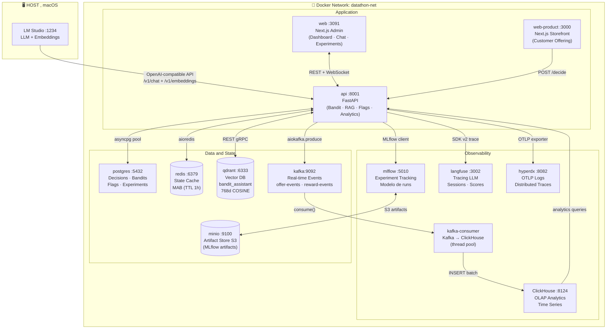
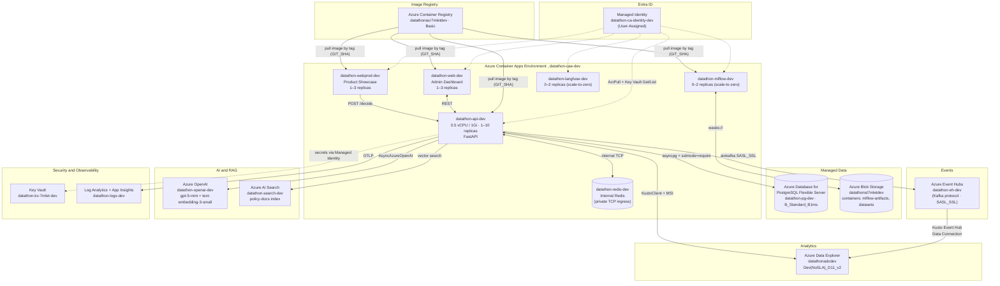
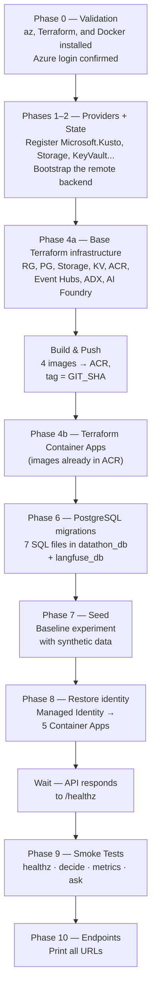
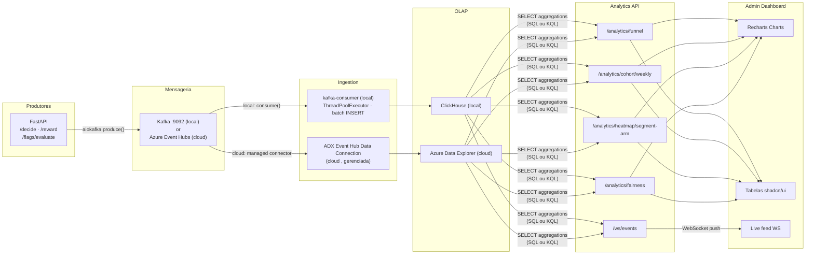
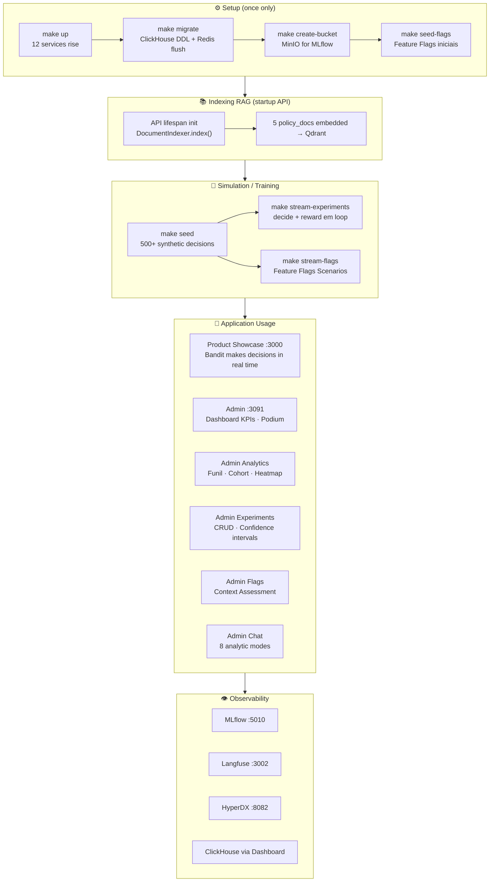
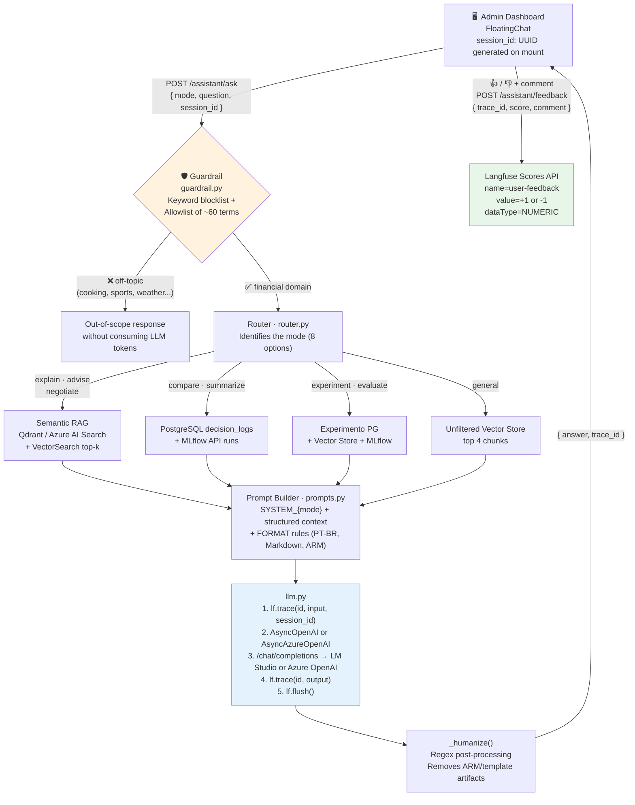

# Datathon 7-MLET, Adaptive Financial Offers Experimentation Platform

This project implements an experimental platform for choosing financial offers, recording the customer's response, and adapting future decisions. The solution combines **Multi-Armed Bandits**, experimentation, feature flags, events, analytics, RAG/LLM, observability, and infrastructure as code.
The repository should be interpreted as an advanced academic prototype and a reference architecture, not as a production-ready platform. This version of the document explicitly distinguishes:

---

## Quick Index

| Section | Content |
|---|---|
| [Executive Summary](#1-executive-summary) | What it is, why MAB, and the business context |
| [Dual-Mode](#2-dual-mode-concept) | Same code, two backends (local ↔ Azure) |
| [Architecture](#3-architecture) | Mermaid diagrams, Docker services, and Azure mapping |
| [ML and Bandits](#4-ml-and-multi-armed-bandits) | Algorithms, segmentation, products, and the learning cycle |
| [RAG and LLM Assistant](#5-rag-and-llm-assistant) | Eight modes, guardrails, indexing, and traceability |
| [Observability](#6-observability) | Logs, metrics, traces, and KPIs |
| [Feature Flags and A/B](#7-feature-flags-and-ab-experiments) | Feature flag engine and statistical experiments |
| [REST API](#8-rest-api) | All endpoints organized by domain |
| [Frontends and SDKs](#9-frontends-and-sdks) | Admin, Product Showcase, Mobile, and Python/TS SDKs |
| [Project Structure](#10-project-structure) | Directory tree with descriptions |
| [Local Execution](#11-local-execution) | Step-by-step setup and Makefile commands |
| [Azure Execution](#12-azure-execution) | Full deployment, cost management, and CI/CD |
| [Environment Variables](#13-environment-variables) | Local, Azure Container Apps, and Makefile variables |
| [Testing and Quality](#14-testing-and-code-quality) | Unit, integration, load, lint, and type checks |
| [Technology Stack](#15-complete-technology-stack) | Complete table by layer |
| [Azure Costs](#16-azure-cost-projections-6-12-18-and-24-months) | TCO over 6/12/18/24 months and operating scenarios |
| [Glossary](#17-glossary) | Project terminology |

---

## 1. Executive Summary

### The Main Challenge

Traditional financial campaigns typically select a single offer for large groups and only measure the outcome after completion. This model separates decision-making, measurement, and learning.

This Datathon closes the cycle:

```text
context → eligibility → policy → offer → interaction → reward → update
```

For each request, the platform:

1. classifies the operational context and segment;
2. filters out unsuitable products according to suitability rules;
3. applies feature flags and active experiments;
4. selects **one** configured policy;
5. records the decision, context, and operational metadata;
6. receives the observed reward;
7. updates the bandit state for future decisions.


### Objective

Build an **end-to-end Machine Learning Engineering platform** for adaptive experimentation with digital financial offers. In real time, the system decides **which financial product to offer each customer**, balancing *exploration* of new alternatives with *exploitation* of the best-known options. It uses **Multi-Armed Bandit (MAB)** algorithms as its primary decision policy, complemented by an **LLM assistant with RAG** for explainability and analytical support.

### Why Multi-Armed Bandit?

| Approach | Problem |
|---|---|
| Fixed rules (`if segment == X → product Y`) | Static; does not learn from actual customer behavior |
| Classic A/B Testing (50/50 split until significance) | Wastes traffic on inferior alternatives for weeks; binary decision at the end |
| **Multi-Armed Bandit (this project)** | Dynamically allocates traffic based on observed rewards, learns continuously, and maintains minimum exploration to avoid getting stuck in local optima |

### Business Context

A digital financial institution needs to decide, in different channels (web, mobile, email, call center), **which offer to present to each eligible customer**, given a catalog of products with distinct risk/reward characteristics.

The base dataset is the **UCI Bank Marketing Dataset** (Kaggle), enriched synthetically with decision/reward events, a catalog of offers, and a golden set of 500 cases for offline evaluation.

### Tech Challenge Requirements Covered

| Required capability | Implementation |
|---|---|
| Receive decision context | `POST /decide` with customer features (age, education, housing, balance, loan) |
| Select the action automatically | Five MAB policies (Thompson, UCB, contextual, and baseline) run in parallel |
| Register decision with justification | PostgreSQL (state) + ClickHouse/ADX (time series) + MLflow (training metrics) |
| Receive rewards and learn online | `POST /reward` updates the policy's Bayesian posterior (Beta) in real time |
| Compare the baseline with adaptive policies | A/B Experiments dashboard with lift, 95% CI, and probability of winning (Monte Carlo) |
| Monitor fairness and exploration | Analytics dashboard, segment×arm heatmap, funnel, weekly cohort, and concentration alerts |
| Maintain decision audit trails | `GET /explain/{decision_id}` + distributed traces in Langfuse/App Insights |
| Analytical Support with LLM (GenAI) | RAG Assistant with 8 analytical modes, domain guardrails, and complete traceability |
| Run in a public cloud | Infrastructure fully defined as code (Terraform) for Azure, with a CI/CD pipeline |

---

## 2. Dual-Mode Concept

**The same Python code runs unchanged both locally and on Azure.** There are no two branches, two application Dockerfile sets, or two route sets; there is one `src/`, and the backend switch happens **entirely via environment variables**, evaluated at `src/config.py`.

```python
# src/config.py (summary)
class Settings(BaseSettings):
    openai_base_url: str = "http://host.docker.internal:1234/v1"   # LM Studio
    qdrant_host: str = "qdrant"
    clickhouse_host: str = "clickhouse"

    azure_openai_endpoint: str = ""
    azure_search_endpoint: str = ""
    kusto_cluster_uri: str = ""

    @property
    def use_azure_openai(self) -> bool: return bool(self.azure_openai_endpoint)
    @property
    def use_azure_search(self) -> bool: return bool(self.azure_search_endpoint)
    @property
    def use_kusto(self) -> bool: return bool(self.kusto_cluster_uri)
```

### Local ↔ Azure Backend Map

| Capacity | Local Backend (Docker) | Production Backend (Azure) | Activation Key |
|---|---|---|---|
| LLM (chat) | LM Studio (`mistral-nemo-instruct-2407`) via `AsyncOpenAI` | Azure OpenAI (`gpt-5-mini`, deployment `gpt-4o`) via `AsyncAzureOpenAI` | `AZURE_OPENAI_ENDPOINT` |
| Embeddings (RAG) | LM Studio (`nomic-embed-text`, 768d) | Azure OpenAI (`text-embedding-3-small`) | `AZURE_OPENAI_ENDPOINT` |
| Vector store (RAG) | Qdrant (self-hosted, collection `bandit_assistant`) | Azure AI Search (index `policy-docs`) | `AZURE_SEARCH_ENDPOINT` |
| Event messaging | Kafka (Confluent, self-hosted) | Azure Event Hubs (Kafka protocol over SASL_SSL) | connection string containing `servicebus.windows.net` in `KAFKA_BOOTSTRAP_SERVERS` |
| Analytics OLAP | ClickHouse (self-hosted) | Azure Data Explorer / Kusto | `KUSTO_CLUSTER_URI` |
| Relational database | PostgreSQL in a container | Azure Database for PostgreSQL Flexible Server | `PG_HOST` + `PG_PASSWORD` |
| Artifact store (MLflow) | MinIO (S3-compatible) | Azure Blob Storage (`wasbs://`) | `MLFLOW_ARTIFACT_ROOT` |
| Service Authentication | fixed credentials in `.env` | Managed Identity (User-Assigned) + Key Vault | automatic in Container Apps |

---

## 3. Architecture

### 3.1 Local Environment (Docker Compose)

12 Docker containers + LM Studio on the host, distributed across 3 layers:



#### Docker Services

| Service | Image | Host Port | Function |
|---|---|---|---|
| `api` | Local build (Python 3.12) | `8001` | FastAPI, business logic, and bandit policies |
| `web` | Build local (Next.js 15) | `3091` | Admin dashboard with graphs and chat |
| `web-product` | Build local (Next.js 15) | `3000` | Products storefront with integrated Bandit |
| `postgres` | `postgres:16-alpine` | `5432` | Decisions, bandit state, experiments, and flags |
| `redis` | `redis:7-alpine` | `6379` | Bandit state cache (hot path) |
| `kafka` | `confluentinc/cp-kafka:7.6.0` | `9092` | Decision and reward event queue |
| `kafka-consumer` | Build local | , | Consumes Kafka → inserts into ClickHouse |
| `clickhouse` | `clickhouse-server:23.3` | `8124` / `9002` | OLAP for analytics and time series |
| `mlflow` | `ghcr.io/mlflow/mlflow` | `5010` | Experiment and Model Tracking |
| `minio` | `minio/minio` | `9100` / `9101` | MLflow compatible S3 artifact store |
| `qdrant` | `qdrant/qdrant:v1.13.6` | `6333` / `6334` | Vector Database for RAG (768 dims, COSINE) |
| `langfuse` | `langfuse/langfuse:2` | `3002` | LLM Calls, Sessions, Scores Tracing |
| `hyperdx` | `hyperdx/hyperdx-local` | `8082` | Distributed Observability with OTLP (distributed logs and traces) |

#### LM Studio (host, out of Docker)

| Function | Model | Endpoint |
|---|---|---|
| LLM (text generation) | `mistral-nemo-instruct-2407` | `http://host.docker.internal:1234/v1/chat/completions` |
| Embeddings (RAG) | `text-embedding-nomic-embed-text-v1.5` | `http://host.docker.internal:1234/v1/embeddings` |

**Model Embedding Requirement:** 768 dimensions , mandatory, as the Qdrant collection was created with `dim=768, distance=COSINE`.

### 3.2 Azure Environment (Production)

Same API endpoints, routers, and business logic; each local dependency is replaced by a managed PaaS service.



#### Azure Resources Inventory (environment `dev`)

Resource Group: `rg-datathon-7mlet-dev`, region `brazilsouth` (except Azure OpenAI in `eastus`).

| Layer | Azure Service | Resource (name) | SKU / Tier |
|---|---|---|---|
| Compute | Container Apps Environment | `datathon-cae-dev` | Consumption |
| Compute | Container App — API | `datathon-api-dev` | 0.5 vCPU / 1Gi, 1–10 replicas |
| Compute | Container App — Web Admin | `datathon-web-dev` | 0.5 vCPU / 1Gi, 1–3 replicas |
| Compute | Container App — Web Product | `datathon-webprod-dev` | 0.5 vCPU / 1Gi, 1–3 replicas |
| Compute | Container App — MLflow | `datathon-mlflow-dev` | 0.5 vCPU / 1Gi, 0–2 replicas (scale-to-zero) |
| Compute | Container App — Langfuse | `datathon-langfuse-dev` | 0.5 vCPU / 1Gi, 0–2 replicas (scale-to-zero) |
| Compute | Container App — Redis | `datathon-redis-dev` | 0.25 vCPU / 0.5Gi, private TCP ingress |
| Identity | Managed Identity (User-Assigned) | `datathon-ca-identity-dev` | , |
| Image Registry | Azure Container Registry | `datathonacr7mletdev` | Basic |
| Relational database | PostgreSQL Flexible Server | `datathon-pg-dev` | `B_Standard_B1ms`, 32GB |
| Object storage | Storage Account | `datathonst7mletdev` | Standard LRS |
| Messaging | Event Hubs | `datathon-eh-dev` | Standard, 1 CU |
| Generative AI | Azure OpenAI | `datathon-openai-dev` | S0, region `eastus` |
| Vector search | Azure AI Search | `datathon-search-dev` | Basic |
| Analytics OLAP | Azure Data Explorer (Kusto) | `datathonadxdev` | `Dev(NoSLA)_Standard_D11_v2` |
|MLOps|Azure Machine Learning Workspace|`datathon-aml2-dev`|Basic (no active compute)|
| Secrets | Key Vault | `datathon-kv-7mlet-dev` | Standard |
| Observability | Log Analytics Workspace | `datathon-logs-dev` | PerGB2018, 30-day retention |
| Observability | Application Insights | `datathon-appinsights-dev` | , |

#### Security and Governance in Azure

- **Managed Identity (User-Assigned)** shared by the 6 Container Apps grants `AcrPull` to the ACR and `Get`/`List` of secrets in the Key Vault
- **Key Vault** stores the Azure OpenAI and AI Search keys; runtime secrets are passed as Container App `secret {}` values
- **`time_sleep` of 120s** after identity creation waits for Azure AD propagation before creating the Container Apps
- **PostgreSQL** uses `sslmode=require`, with its firewall open to Azure services
- **ADX** receives events via its own role assignment mechanism (`Azure Event Hubs Data Receiver`)

#### Terraform Structure

```
infra/terraform/
├── main.tf                    # RG, PostgreSQL, Storage, Log Analytics, Application Insights, Key Vault + orchestration
├── variables.tf               # prefix, location, environment, image_tag, passwords
├── outputs.tf                 # Container App URLs, FQDNs, and endpoints
├── versions.tf                # providers: azurerm 3.117, azapi 1.15, time 0.14
├── environments/dev.tfvars    # values of the development environment
├── environments/prod.tfvars   # environment values for production
├── vars/dev.tfvars            # values used by the targets `make azure-*`
└── modules/
    ├── event_hubs/            # Namespace + Event Hub "offer-events" + consumer group
    ├── azure_ml/              # ACR + Azure ML Workspace
    ├── ai_foundry/            # Azure OpenAI (gpt-5-mini + embeddings) + AI Search
    ├── azure_data_explorer/   # Kusto cluster + KQL tables + Event Hub Data Connection
    └── container_apps/        # 6 Container Apps + Managed Identity + Environment
```

#### Azure Deployment Flow, `make azure-full-deploy`

Full deployment in 10 sequential phases:



The order **base infra → build & push → Container Apps** is deliberate: images need to exist in the ACR before Terraform creates the Container Apps.

#### Azure Cost Management

| Command | What it does | When to use |
|---|---|---|
| `make azure-pause` | Stops ADX and scales Container Apps to 0 replicas | End of day / sprint (~US$42–65/month residual) |
| `make azure-resume` | Restarts ADX (~3 min) and returns Container Apps to 1–3 replicas | When resuming work |
| `make azure-backup` | `pg_dump` + download of MLflow artifacts | Before any destruction |
| `make azure-purge` | Purge soft-deleted resources (*Key Vault 9 days, OpenAI 4 hours*) | After destroy to recreate with same name |
| `make azure-safe-destroy` | Guided Backup + `terraform destroy` (requires entering `destroy`) | Final Shutdown |

### 3.3 End-to-End Data Flow (local)

```
1. Customer or simulator → POST /decide
   └─ body: { features: {...}, policy: "thompson", channel: "web" }
   
2. API, FastAPI (src/api/routers/decide.py)
├─ Evaluate Feature Flags (flag_engine)
├─ Classify segment (segmentation.py → 1 of 6 segments)
├─ Load active policy (PolicyRegistry → Redis → PostgreSQL)
   ├─ policy.select_arm(context, arms) → arm + confidence + is_exploration
├─ Persist decision in PostgreSQL (decision_logs)
├─ Emit event to Kafka (offer-events)
   └─ Resposta: { decision_id, offer_id, confidence, is_exploration, segment }

3. Kafka Consumer (src/logging/kafka_consumer.py)
└─ Consume events → INSERT into ClickHouse (datathon.flag_events)

4. Client → POST /reward  { decision_id, reward }
├─ Decision Search in PostgreSQL
├─ policy.update(arm, reward) → update α/β of the posterior Beta
├─ Persist state in PostgreSQL + Redis (TTL 1h)
   ├─ Registra MLflow run (cumulative_reward, avg_reward, exploration_rate)
└─ Emit event for reward to Kafka
```

### 3.4 Bandit Learning Cycle

```mermaid
sequenceDiagram
    autonumber
actor C as Customer / Simulator
participant API as FastAPI
participant SEG as Segmentation
participant POL as Policy MAB
    participant RDS as Redis Cache
participant PG as PostgreSQL
    participant KF as Kafka / Event Hubs
    participant MLF as MLflow

    rect rgb(230, 245, 255)
        note over C,KF: ── FASE DECIDE ──
        C->>API: POST /decide {features, policy="thompson"}
        API->>SEG: classify_segment(age, edu, housing, loan, balance)
        SEG-->>API: segment = "senior_high_edu"
        API->>RDS: GET bandit_state:{policy}
RDS → API: {α, β} by arm (cache hit)
        API->>POL: select_arm(context, arms)
        note over POL: θ_a ~ Beta(α_a, β_a)<br/>→ argmax(θ_a)<br/>exploration se gap < 0.05
        POL-->>API: arm="term_deposit_12m"<br/>confidence=0.81, is_exploration=false
        API->>PG: INSERT decision_logs (decision_id, arm, segment, policy)
        API->>KF: produce(offer-events, {decision_id, arm, segment, channel})
        API-->>C: {decision_id, offer_id, confidence, segment}
    end

    rect rgb(230, 255, 235)
note over C,MLF: ─── REWARD PHASE (learning) ───
        C->>API: POST /reward {decision_id, reward=1}
        API->>PG: SELECT decision WHERE id=decision_id
        PG-->>API: arm, segment, policy_name
        API->>POL: update(arm, reward)
        note over POL: reward > 0 → α_arm += reward<br/>reward = 0 → β_arm += 1
POL >> API: new state {α, β}
        API->>PG: UPDATE bandit_state SET alpha, beta, n_pulls
        API->>RDS: SET bandit_state:{policy} (TTL=3600s)
        API->>MLF: log_metrics(cumulative_reward, avg_reward,<br/>exploration_rate, n_decisions)
        API->>KF: produce(reward-events, {decision_id, reward, arm})
        API-->>C: {updated: true, new_alpha, new_beta}
    end
```

### 3.5 Analytics Pipeline



### 3.6 Full Application Flow (Local)



---

## 4. ML and Multi-Armed Bandits

### 4.1 Implemented Policies

| Policy | Module | Algorithm | Contextual |
|---|---|---|---|
| `thompson` | `src/policies/thompson.py` | Thompson Sampling (Beta-Binomial) | No |
| `contextual_thompson` | `src/policies/contextual_thompson.py` | Thompson Sampling by segment | Yes |
| `ucb` | `src/policies/ucb.py` | Upper Confidence Bound (UCB1) | No |
| `contextual_ucb` | `src/policies/contextual_ucb.py` | UCB by segment | Yes |
| `baseline` | `src/policies/baseline.py` | Epsilon-greedy / random | No |

### 4.2 Thompson Sampling (default policy)

```
For each arm a:
    θ_a ~ Beta(α_a, β_a)    ← sample from the posterior distribution

Select: argmax_a(θ_a)

Update after reward r:
    r > 0: α_a += r         ← success
    r = 0: β_a += 1         ← failure

Initial prior: α = 1, β = 1 (uniform, unbiased)
```

**Contextual Thompson** maintains an independent `(α, β)` pair for each `(segment, arm)`, allowing the policy to learn different preferences for each customer profile.

### 4.3 UCB1

```
Select: argmax_a [ μ_a + C × √(ln N / n_a) ]

μ_a = average reward for arm a
N   = total number of decisions
n_a = decisions for arm a
C   = exploration constant (default: √2 ≈ 1.414)
```

### 4.4 State and Persistence

Bandit state (α, β, and counters) is stored in the **relational database** (local PostgreSQL or Azure Flexible Server) as the source of truth and in **Redis** as a hot cache (TTL 1h). On each `update`, MLflow records a `run` with the current metrics for complete historical traceability.

### 4.5 Financial Products (Arms)

Each product has a documented **product policy** in `datasets/policy_docs/` (Markdown format), used as the knowledge base for RAG.

| Product | CDI / Rate | Target Audience | Avg. Conversion |
|---|---|---|---|
| `savings_account` , Savings Account | Standard savings | Any profile, immediate liquidity | 8% |
| `premium_savings` — Premium Savings | Higher return than standard savings | Balance > R$500, low risk | 19% |
| `term_deposit_6m` — 6-Month Term Deposit | 102% CDI | Medium-term horizon, age 30–55 | 14% |
| `term_deposit_12m`, CDB 12 Months | 110% CDI | Senior, high balance, long-term | 22% |
| `personal_loan` — Personal Loan | Market rate | Customers who need credit or carry debt | 11% |

### 4.6 Customer Segmentation

Deterministic **segmentation** based on business rules, calculated in `src/data/segmentation.py`:

```
Features: age (int), education (str), housing (str), loan (str), balance (float)

┌────────────────────────────────────────────────────────────┐
│  age < 30                         → "young"                │
│  age ≥ 45 + higher education     → "senior_high_edu"      │
│  age ≥ 45                         → "senior"               │
│  30-44 + housing=yes + loan=yes   → "mid_indebted"         │
│  30-44 + balance > R$1.000        → "mid_low_risk"         │
│  otherwise                        → "default"              │
└────────────────────────────────────────────────────────────┘
```

In Contextual Thompson, each segment maintains independent priors. The bandit learns, for example, that a 12-month term deposit converts better for `senior_high_edu`, while a personal loan converts better for `mid_indebted`.

---

## 5. RAG and LLM Assistant

The **Finance Assistant** is a complete RAG system integrated to the admin dashboard, answering analytical questions about the system using LlamaIndex as an orchestration layer with a pluggable backend (Qdrant/LM Studio local ↔ Azure AI Search/Azure OpenAI).

### 5.1 Index Construction (Indexing)

Executed at API startup. Writes to Qdrant locally; writes to Azure AI Search in Azure, same class `DocumentIndexer`.

```mermaid
flowchart LR
    subgraph SRC["📁 datasets/policy_docs/"]
        D1["term_deposit_6m.md\n102% CDI · 6 months"]
        D2["term_deposit_12m.md\n110% CDI · 12 months"]
        D3["savings_account.md\nTraditional Savings Account"]
        D4["premium_savings.md\nPremium Savings"]
        D5["personal_loan.md\nPersonal Loan"]
    end

    subgraph IDX["DocumentIndexer  ·  indexer.py"]
        LOAD["SimpleDirectoryReader\n+ MetadataExtractor"]
        SPLIT["SentenceSplitter\nchunk_size=512\noverlap=64"]
        META["Payload Metadata\ndoc_type · arm\nproduct_name · source"]
    end

    subgraph EMB["Embeddings"]
        MODEL_L["LM Studio (local)\nnomic-embed-text-v1.5\n768 dimensions"]
        MODEL_A["Azure OpenAI (cloud)\ntext-embedding-3-small"]
    end

    subgraph VDB["Vector Store"]
QD["Qdrant (local)\nbandit_assistant\nCOSINE · dim=768"]
        AS["Azure AI Search (cloud)\npolicy-docs index"]
    end

    SRC --> LOAD --> SPLIT --> META
    META -->|"use_azure_openai=false"| MODEL_L --> QD
    META -->|"use_azure_openai=true"| MODEL_A --> AS

    style SRC fill:#fff3e0
    style IDX fill:#e8f5e9
    style EMB fill:#e3f2fd
    style VDB fill:#f3e5f5
```



### 5.2 Query Flow (Retrieval)



### 5.3 8 Analysis Modes

| Mode | Description | Recovered Context |
|---|---|---|
| `explain` | Why did the bandit take this decision? | Decision + policy state + arm's policy document |
| `compare` | Performance Comparison Between Policies | PostgreSQL decision_logs (aggregated metrics) |
| `summarize` | MLflow Runs Summary for a Policy | MLflow API (last 20 runs) |
| `experiment` | Complete analysis of an A/B experiment | Experiment + decisions + MLflow + policy docs |
| `evaluate` | Structured evaluation report | Vector store (indexed experiment document) + MLflow |
| `advise` | Customized recommendation by profile | Segment + state bandit + policy docs (top 3) |
| `negotiate` | Responses to customer objections | Policy document for the offered product |
| `general` | General questions about the system | Filter-free vector store (top 4) + metrics |

### 5.4 Domain Guardrail

Before any call to the LLM, the `guardrail.py` validates whether the question pertains to the financial/infrastructure domain using two layers:
1. **Blocklist** of clearly off-topic terms (cuisine, sports, weather)
2. **Allowlist** of financial and platform terms (~60 terms)

Blocked questions return an out-of-scope message without consuming LLM tokens.

### 5.5 Langfuse Traceability

Each call to the LLM generates a **trace** in Langfuse with:
- `session_id`: Session UUID of the chat session (groups the entire conversation)
- `input`: question + full context sent to the model
- `output`: generated response
- **Generation**: tokens used, latency, model name
- **Score**: feedback 👍/👎 with comment, linked to exact trace

---

## 6. Observability

Three pillars of observability with a pluggable backend between local and Azure.

### 6.1 Logs

- All modules use `structlog` with JSON output
- **Local:** exported via OpenTelemetry to **HyperDX** (`http://localhost:8082`)
- **Azure:** exported via OpenTelemetry to **Application Insights / Log Analytics** (`APPLICATIONINSIGHTS_CONNECTION_STRING`)

### 6.2 Metrics

| Source | Local | Azure | Data |
|---|---|---|---|
| OLAP | ClickHouse (`datathon.events`, `datathon.flag_events`) | Azure Data Explorer / Kusto (`flag_events`, `decision_logs`) | Real-time Events: decision, reward, flags, segment, channel |
| Experiment tracking | MLflow (`http://localhost:5010`) | MLflow in Container App (scale-to-zero) | Cumulative reward, Average reward, Exploration rate history |
| Transactional State | PostgreSQL | Azure Database for PostgreSQL Flexible Server | Bandit States, Decisions, Experiments |

### 6.3 Traces — Langfuse (identical locally and in Azure)

- **Traces LLM**: model, tokens, latency, prompt, completion
- **Sessions**: complete conversation grouped by `session_id`
- **Scores**: user feedback (`user-feedback`, value `1` or `-1`, comment)

### 6.4 Key Performance Indicators and Business Metrics

| Metric | Description |
|---|---|
| Average Reward | Mean Reward per Decision (Conversion Proxy) |
| Accumulated Regret | Difference vs. Theoretical Optimal Policy |
| Conversion rate by arm | Conversions per product decision |
| Exploration Rate | % of Decisions in Exploration Mode |
| Exposure Balance | Segment Distribution of Decisions (fairness) |

### 6.5 Technical Metrics and Where to Monitor

| Metric | Local | Azure |
|---|---|---|
| `/decide` p50/p95/p99 latency | HyperDX → traces | Application Insights → traces |
| Decision throughput | HyperDX → metrics | Log Analytics |
| Vector collection size | `GET http://localhost:6333/collections/bandit_assistant` | Azure Portal → AI Search → index `policy-docs` |
| Run MLflow Policy | http://localhost:5010 → Experiment `datathon-bandit` | MLflow URL in Container App |
| Traces LLM (tokens, latency) | http://localhost:3002 → Langfuse Sessions | Langfuse Container App URL |
| Service Cost | (No Cost) | Azure Portal → Cost Management, filtered by `rg-datathon-7mlet-dev` |

### 6.6 Useful Verification Commands

```bash
# Active policy metrics (local)
curl http://localhost:8001/metrics/?policy=thompson

# Fairness (concentration by segment)
curl http://localhost:8001/analytics/fairness

# Test the assistant
curl -X POST http://localhost:8001/assistant/ask \
  -H "Content-Type: application/json" \
  -d '{"mode":"compare","question":"Which policy has the best reward?"}'

# Smoke test against the published Azure environment
make azure-smoke-test
```

---

## 7. Feature Flags and A/B Experiments

### 7.1 Feature Flags

Engine at `src/services/flag_engine.py` with conditional rule evaluation:

```json
{
  "flag_key": "premium_offer_enabled",
  "flag_type": "boolean",
  "default_value": false,
  "rules": [
    {
      "condition": { "segment": "senior_high_edu", "channel": "web" },
      "value": true
    }
  ]
}
```

API: `GET/POST/PUT/DELETE /flags/{flag_key}`, with support for toggle, contextual evaluation, and audit.

### 7.2 A/B Experiments

Experiments in `PostgreSQL` with arms, target segments, channels, and primary metrics. Results calculated with:
- Expected **lift** for arm
- **Confidence Interval 95%** (Posterior Beta)
- **Probability Best**: P(arm_i is better) via Monte Carlo simulation
- **Automatic winner recommendation** when the sample is sufficient

---

## 8. REST API

Base URL local: `http://localhost:8001` · Interactive documentation: `http://localhost:8001/docs`
Base URL Azure: `https://<datathon-api-dev>.<region>.azurecontainerapps.io` (printed by `make azure-endpoints`)

### Core Bandit

| Method | Endpoint | Description |
|---|---|---|
| `POST` | `/decide/` | Request a Bandit decision for the customer |
| `POST` | `/reward/` | Sends reward and updates the model |
| `GET` | `/decisions/` | Historical Decisions List (Paginated) |
| `GET` | `/explain/{decision_id}` | Audit: why that decision was made |
| `GET` | `/metrics/` | Active Policy Key Performance Indicators |
| `GET` | `/metrics/all` | All policies' KPIs |
| `GET` | `/metrics/channels` | Metrics by channel |
| `GET` | `/healthz` | Healthcheck (postgres + redis) |

### LLM/RAG Assistant

| Method | Endpoint | Description |
|---|---|---|
| `POST` | `/assistant/ask` | Analytical Question (8 modes) |
| `POST` | `/assistant/feedback` | Send score 👍/👎 to Langfuse |

### MLOps

| Method | Endpoint | Description |
|---|---|---|
| `GET` | `/mlops/runs/` | Run the MLflow for a policy |

### Feature Flags

| Method | Endpoint | Description |
|---|---|---|
| `GET` | `/flags/` | List all feature flags |
| `POST` | `/flags/` | Create new flag |
| `PUT` | `/flags/{key}` | Update flag |
| `DELETE` | `/flags/{key}` | Remove Flag |
| `POST` | `/flags/{key}/toggle` | Enable/disable flag |
| `POST` | `/flags/{key}/evaluate` | Evaluate flag with context |
| `GET` | `/flags/{key}/audit` | Change History |

### Experiments

| Method | Endpoint | Description |
|---|---|---|
| `GET` | `/experiments/` | Experiments List |
| `POST` | `/experiments/` | Create experiment |
| `PUT` | `/experiments/{id}/start` | Start experiment |
| `PUT` | `/experiments/{id}/stop` | Close experiment |
| `GET` | `/experiments/{id}/results` | Results with statistics |
| `POST` | `/experiments/{id}/synthetic` | Generate synthetic data |

### Analytics

| Method | Endpoint | Description |
|---|---|---|
| `GET` | `/analytics/funnel` | Decision Funnel → Conversions |
| `GET` | `/analytics/cohort/weekly` | Weekly cohort by policy |
| `GET` | `/analytics/heatmap/segment-arm` | Segment of Interest × Arm Heatmap |
| `GET` | `/analytics/fairness` | Concentration and fairness alerts |
| `GET` | `/analytics/flag-scenarios` | Scenario-based feature flag analytics |
| `WS` | `/ws/events` | WebSocket , real-time events |

---

## 9. Frontends and SDKs

### Admin Dashboard (`web/`, port `3091`)

Next.js 15 + React 19 + Tailwind + shadcn/ui + Recharts

| Page | Content |
|---|---|
| `/` | Main Dashboard: KPIs, Arms Podium, Reward graphs |
| `/analytics` | Funnel, weekly cohort, heatmap, fairness, flag scenarios |
| `/experiments` | Experiments CRUD, statistical results with confidence intervals |
| `/experiments/[id]` | Experiment details with lift graphs by arm |
| `/flags` | Real-time Evaluation Feature Flag Management |
| `/simulator` | Configurable Bandit Decision Simulator with Customer Profile Configuration |

**Floating Chat**: on all pages, the RAG assistant is available as a floating chat with 8 analysis modes, Markdown rendering, and saved like/dislike buttons 👍/👎 comments in Langfuse.

### Products Gallery (`web-product/`, local port `3000`)

Next.js 15 integrated to `/decide`, simulates the digital channel where the bandit presents offers to the customer.

### Mobile App (`mobile/`)

Expo 52 + React Native 0.76 + NativeWind + `expo-router`. Screens: home, metrics (`metrics.tsx`), and simulator (`simulator.tsx`), all consuming the same REST API.

### Integration SDKs (`sdk/`)

| SDK | Location | Use |
|---|---|---|
| Python | `sdk/python/bandit_sdk/` (`client.py`, `models.py`) | Integrating other Python services with `/decide`, `/reward`, `/flags` |
| TypeScript | `sdk/typescript/src/` (`client.ts`, `flag-engine.ts`, `types.ts`) | Frontend/Service Node Integrations with the API and Local Evaluation of Flags |

---

## 10. Project Structure

```
postech-fiap-ml-tech-challege-5-datathon/
│
├── src/                          CODE PYTHON (API + ML) , runs identical locally/Azure
│   ├── api/                      FastAPI: app, modelos Pydantic, 11 routers
│   │   ├── main.py               App + lifespan + middlewares
│   │   ├── models.py             Request/response models
│   │   └── routers/              decide, reward, experiments, flags, analytics, assistant...
│   ├── policies/                 Algoritmos MAB (Thompson, UCB, contextuais, baseline)
│   ├── assistant/                RAG + LLM (dual-mode local/Azure)
│   │   ├── pipeline.py           Orchestration of LlamaIndex with Qdrant/Azure AI Search
│   │   ├── indexer.py            Indexation policy_docs → vector store
│   │   ├── llm.py                Client LLM (AsyncOpenAI/AsyncAzureOpenAI, Langfuse-wrapped)
│   │   ├── router.py             + feedback in 8 analysis modes
│   │   ├── retriever.py          Context Loaders by Mode
│   │   ├── prompts.py            System templates in English
│   │   ├── guardrail.py          Validation of domain (no LLM)
│   │   ├── negotiation.py        Mode objection negotiation
│   │   └── tracing.py            Setup Langfuse SDK
│   ├── data/                     Load Kaggle, segmentation (6 segments), synthetic data
│   ├── storage/                  PostgreSQL asyncpg, Redis cache, MLflow client
│   ├── evaluation/               CTR, reward, regret, exploration rate, offline replay
│   ├── stats/                    Statistical calculations Thompson
│   ├── logging/                  Kafka consumer → ClickHouse, OpenTelemetry, audit logging
│   ├── services/                 Feature Flag Evaluation Engine
│   └── config.py                 Settings Pydantic (env-driven, dual-mode local/Azure)
│
├── web/                          ADMIN DASHBOARD (Next.js 15, port 3091)
├── web-product/                  WEB PRODUCT VITRINE (Next.js 15, port 3000)
├── mobile/                       APP MOBILE (Expo + React Native)
│
├── sdk/                          Integration SDKs
│   ├── python/bandit_sdk/        Python: client.py, models.py
│   └── typescript/               TypeScript: client.ts, flag-engine.ts, types.ts
│
├── infra/                        Infraestrutura
│   ├── Dockerfile                Multi-stage Python 3.12 (image of API)
│   ├── Dockerfile.mlflow         Image of the MLflow service
│   ├── sql/                      9 SQL migrations (sequential DDL, local and Azure)
│   ├── clickhouse/               Configure ClickHouse (memory tuning), only local
│   └── terraform/                IaC Azure (Container Apps + Event Hubs + AI Foundry + ADX)
│
├── datasets/                     Data Sets
│   ├── kaggle/                   Dataset original (UCI Bank Marketing)
│   ├── processed/                bank_clean.parquet (post-clean)
│   ├── synthetic_enrichment/     Synthetic Events + Catalog of Offers
│   ├── golden_set/               500 cases for offline evaluation
│   ├── eval_results/             Evaluation Results Offline
│   └── policy_docs/              5 documents Markdown (knowledge base RAG)
│
├── notebooks/                    Notebooks Jupyter
│   ├── 01_eda.ipynb              Exploratory Data Analysis of Kaggle Dataset
│   ├── 02_synthetic_enrichment.ipynb   Synthetic Data Generation
│   └── 03_offline_evaluation.ipynb     Comparative Policies (Offline)
│
├── tests/                        Tests
│   ├── unit/                     Unit Policies MAB + Assistant Modules
│   ├── integration/              Endpoints of the end-to-end API
│   └── load/locustfile.py        Load Testing Scenarios
│
├── scripts/                      Script automation scripts
│   ├── seed_bulk.py              Seed of 500+ decisions in parallel
│   ├── seed_product_flags.py     Initialize feature flags in the database
│   ├── event_stream.py           Stream Events to API
│   ├── stream_experiments.py     Simulate decisions in AB experiments
│   ├── stream_flags.py           Execute feature flag scenarios
│   └── simulate.py               Simulation decides+reward against Remote API (Azure)
│
├── .github/workflows/            CI/CD , 5 workflows (ci, build-push, deploy, cd, terraform)
├── notes/                        Project internal documentation
├── docker-compose.yml            Orchestrating 12 local services
├── Makefile                      Local Automation + Azure (build, test, seed, deploy)
├── pyproject.toml                Python Project Dependencies (uv)
├── .env.example                  Local Environment Variables Template
├── .env-azure.example            Template of variables for Azure Makefile
└── docs/                         Documentation complementing (ARCHITECTURE, PLAN_BUILD_DESTROY_AZURE)
```

---

## 11. Local Execution

### Prerequisites

- Docker Desktop ≥ 4.x (macOS/Linux)
- [LM Studio](https://lmstudio.ai) with the `mistral-nemo-instruct-2407` and `text-embedding-nomic-embed-text-v1.5` models loaded and the local server running on port `1234`
- Python 3.12+ with `uv` (only for development outside the container and for notebooks)

### Step-by-Step Setup

```bash
# 1. Configure environment variables
cp .env.example .env

# 2. Start the 12 Docker services
make up

# 3. Initialize ClickHouse and Redis
make migrate

# 4. Create a MinIO bucket (first time)
make create-bucket

# 5. Initial Data Seeding
make seed-flags   # feature flags in PostgreSQL
make seed         # 500+ synthetic decisions

# 6. Verify RAG Indexing (Automatically Runs During Startup of the API)
curl http://localhost:8001/healthz
# → {"status":"ok","services":{"postgres":"ok","redis":"ok"}}

docker compose logs api | grep qdrant
# look for: "rag_pipeline_ready"

# 7. Simulate decisions and train the bandit
make stream-experiments   # decide + reward in loop for AB experiments
make stream-flags         # scenario-driven by feature flags

# 8. Access the interfaces
```

### Local Interfaces

| Interface | URL | Credentials |
|---|---|---|
| Admin Dashboard | http://localhost:3091 | , |
| Products Showcase | http://localhost:3000 | , |
| API Docs (Swagger) | http://localhost:8001/docs | , |
| MLflow | http://localhost:5010 | , |
| Langfuse | http://localhost:3002 | Verify `.env` |
| HyperDX | http://localhost:8082 | , |
| MinIO Console | http://localhost:9101 | `minioadmin` / `minioadmin` |

### Local Maintenance Commands

```bash
make down           # docker compose down
make restart        # restarts only the API container
make logs           # follows the API and MLflow logs
make test           # unit tests (uv run pytest tests/unit -v)
make lint           # ruff check
make fmt            # ruff format
make type-check     # mypy
```

---

## 12. Azure Execution

### Prerequisites

- Azure account with `Owner`/`Contributor` permission on the target subscription
- Authenticated Azure CLI (`az login`)
- Terraform ≥ 1.7.5
- Docker (to build and push images to ACR)
- `psql` (for migrations) and `gh` CLI (optional for OIDC setup)

### Complete Deployment

```bash
# 1. Configure Makefile variables
cp .env-azure.example .env-azure
# fill in: PG_PASSWORD (required), LANGFUSE_SECRET_KEY, LANGFUSE_PUBLIC_KEY

# 2. Validate tools and sign in
make azure-check-tools     # checks az, terraform, and docker
make azure-login           # interactive az login

# 3. Full Deployment (10 automated phases)
make azure-full-deploy PG_PASSWORD=<your-password>

# 4. Verify Published Endpoints
make azure-endpoints

# 5 (optional). Upload datasets and simulate traffic
make azure-upload-datasets   # uploads processed/, synthetic_enrichment/, golden_set/...
make azure-simulate          # 200 rounds of decide+reward against the Azure API
```

### Partial Deploys (after the first `azure-full-deploy`)

```bash
make azure-build-api                              # rebuild and push only the API image
make azure-deploy-all                             # build+push+terraform Container Apps+migrate+seed+smoke
```

### Cost Management

```bash
make azure-pause     # ADX stopped + Container Apps at 0 replicas (~US$42–65/month residual)
make azure-resume    # resumes all services
make azure-backup PG_PASSWORD=<password>       # PostgreSQL dump + MLflow artifact download
make azure-safe-destroy PG_PASSWORD=<password> # backup + guided terraform destroy
make azure-purge                            # releases reserved names in soft-delete after a destroy
```

### CI/CD via GitHub Actions (OIDC)

```bash
make azure-oidc-setup GITHUB_ORG=<org>        # creates federated credentials in Azure AD
make azure-github-secrets GITHUB_ORG=<org>    # set AZURE_CLIENT_ID/TENANT_ID/SUBSCRIPTION_ID as repo secrets
```

From then on, every push to `main` that alters `src/`, `web/`, `web-product/` or `infra/Dockerfile` automatically triggers the workflow **Build & Push** → **Deploy to Container Apps**.

#### Workflows GitHub Actions

| Workflow | Trigger | What does it do |
|---|---|---|
| `ci.yml` , CI | Push to any branch/PR to `main` | Lint (ruff), type-check (mypy), unit tests |
| `build-push.yml` , Build & Push | Push to `main` that changes `src/`, `web/`, `web-product/`, `infra/Dockerfile` or `pyproject.toml` | Build Docker images and push to the ACR, tag = commit SHA |
| `deploy.yml` , Deploy to Container Apps | `workflow_run` triggered by the completion of Build & Push, in `main` | Update the Container Apps with the new image |
| `cd.yml` , CD (Build + Deploy) | Push to `main`, or manual `workflow_dispatch` with customizable tag | Combined pipeline for build + deploy directly in the Container App `datathon-api-dev` |
| `terraform.yml`, Terraform | PR/Push to `main` that changes `infra/terraform/**` | `terraform plan`/`apply` (Terraform 1.7.5) against the infrastructure |

---

## 13. Environment Variables

### Local (`.env`, based on `.env.example`)

| Variable | Default | Description |
|---|---|---|
| `DATABASE_URL` | `postgresql+asyncpg://...` | PostgreSQL asynchronous |
| `REDIS_URL` | `redis://redis:6379/0` | Redis URL |
| `KAFKA_BOOTSTRAP_SERVERS` | `kafka:9092` | Kafka brokers (or Azure Event Hubs connection string) |
| `MLFLOW_TRACKING_URI` | `http://mlflow:5000` | MLflow server |
| `OPENAI_BASE_URL` | `http://host.docker.internal:1234/v1` | LLM Endpoint (LM Studio) |
| `OPENAI_API_KEY` | `lm-studio` | Local LLM endpoint API Key |
| `LLM_MODEL` | `mistral-nemo-instruct-2407` | Local LLM model name |
| `EMBED_BASE_URL` | `http://host.docker.internal:1234/v1` | Embeddings endpoint |
| `EMBED_MODEL` | `text-embedding-nomic-embed-text-v1.5` | Embedding Model (768d) |
| `QDRANT_HOST` / `QDRANT_PORT` | `qdrant` / `6333` | Vector Store Local |
| `CLICKHOUSE_HOST` | `clickhouse` | Local OLAP |
| `LANGFUSE_ENABLED` | `false` | Enable Langfuse Tracing |
| `LANGFUSE_PUBLIC_KEY` / `LANGFUSE_SECRET_KEY` | , | Langfuse keys |
| `LANGFUSE_HOST` | `http://langfuse:3000` | Langfuse Address |
| `ACTIVE_POLICY` | `thompson` | Active policy of the bandit |
| `UCB_C` | `1.414` | UCB Exploration Constant |
| `LOG_LEVEL` | `INFO` | Log Level |

### Azure (defined automatically by Container Apps via Terraform)

| Variable | Origin | Description |
|---|---|---|
| `PG_HOST` / `PG_PASSWORD` | `azurerm_postgresql_flexible_server.pg` | Enables the construction of `DATABASE_URL` with `sslmode=require` |
| `KAFKA_BOOTSTRAP_SERVERS` | `module.event_hubs.kafka_connection_string` | Event Hubs connection string (SASL_SSL protocol) |
| `AZURE_OPENAI_ENDPOINT` / `AZURE_OPENAI_KEY` | `module.ai_foundry.openai_endpoint/key` | Activate `use_azure_openai` LLM/embeddings to Azure OpenAI |
| `AZURE_OPENAI_DEPLOYMENT` | `gpt-4o` (Real Model Deployment `gpt-5-mini`) | Chat Deployment |
| `AZURE_EMBED_DEPLOYMENT` | `text-embedding-3-small` | Embeddings Deployment |
| `AZURE_SEARCH_ENDPOINT` / `AZURE_SEARCH_KEY` | `module.ai_foundry.ai_search_endpoint/key` | Activate `use_azure_search`, switch from Qdrant to Azure AI Search |
| `KUSTO_CLUSTER_URI` / `KUSTO_MSI_CLIENT_ID` | `module.azure_data_explorer.cluster_uri` + Managed Identity | Enable `use_kusto` , replace ClickHouse with ADX |
| `APPLICATIONINSIGHTS_CONNECTION_STRING` | `azurerm_application_insights.appinsights` | Export traces OTLP to Azure Monitor |
| `MLFLOW_ARTIFACT_ROOT` | `wasbs://mlflow-artifacts@...blob.core.windows.net/` | MLFlow Artifacts in the Blob Storage |

### Makefile — Azure deployment (`.env-azure`, based on `.env-azure.example`)

| Variable | Example | Description |
|---|---|---|
| `ACR_NAME` / `ACR_SERVER` | `datathonacr7mletdev` / `....azurecr.io` | Image Registry |
| `RG_NAME` | `rg-datathon-7mlet-dev` | Target Resource Group |
| `PG_PASSWORD` | , (mandatory) | Admin Password for PostgreSQL Flexible Server |
| `LANGFUSE_SECRET_KEY` / `LANGFUSE_PUBLIC_KEY` | `sk-lf-...` / `pk-lf-...` | Assistant Observability Keys |
| `STORAGE_ACCOUNT` | `datathonst7mletdev` | Storage account (datasets + MLflow) |
| `TF_PREFIX` / `TF_ENVIRONMENT` | `datathon` / `dev` | Used as a prefix for all resource names across environments |
| `GITHUB_ORG` | , | Only for `make azure-oidc-setup` (federated credentials) |

---

## 14. Testing and Code Quality

```bash
make test              # unit tests — uv run pytest tests/unit/ -v
make test-integration  # integration tests — uv run pytest tests/integration/ -v --timeout=30
make test-all          # unit + integration
make load-test         # locust , 10 users, 2/s of ramp-up, 30s, against localhost:8000
make lint              # ruff check src/ tests/
make fmt               # ruff format src/ tests/
make type-check        # mypy src/
```

- `tests/unit/` , covers policies MAB (Thompson, UCB, contextual, baseline) and assistant modules
- `tests/integration/` covers API endpoints end to end
- `tests/load/locustfile.py` , load scenarios

---

## 15. Complete Technology Stack

| Layer | Technologies |
|---|---|
| **API** | Python 3.12, FastAPI 0.115, asyncpg, aiokafka, httpx, Pydantic/pydantic-settings |
| **ML** | NumPy (Thompson/UCB posterior), scikit-learn (offline evaluation) |
| **RAG** | LlamaIndex 0.12, Qdrant v1.13 (local) / Azure AI Search (cloud), nomic-embed-text 768d (local) / text-embedding-3-small (cloud) |
| **LLM** | LM Studio , `mistral-nemo-instruct-2407` (local) / Azure OpenAI , `gpt-5-mini` (cloud), both via OpenAI-compatible API |
| **Data (local)** | PostgreSQL 16, Redis 7, ClickHouse 23.3, MLflow + MinIO |
| **Data (Azure)** | Azure Database for PostgreSQL Flexible Server, Redis (Container App), Azure Data Explorer (Kusto), MLflow + Azure Blob Storage |
| **Messaging** | Kafka , Confluent 7.6 (local) / Azure Event Hubs, Kafka protocol (cloud) |
| **Observability** | Langfuse 2, structlog, OpenTelemetry, HyperDX (local) / Application Insights + Log Analytics (Azure) |
| **Frontend Admin** | Next.js 15, React 19, Tailwind 4, shadcn/ui, Recharts, react-markdown |
| **Product Frontend** | Next.js 15, React 19 |
| **Mobile** | Expo 52, React Native 0.76, NativeWind, expo-router |
| **SDKs** | Python (`bandit_sdk`), TypeScript |
| **Local infrastructure** | Docker Compose (12 services) |
| **Infra cloud** | Terraform (azurerm 3.117, azapi 1.15), Azure Container Apps, PostgreSQL Flexible Server, Event Hubs, Azure Data Explorer, Azure OpenAI, Azure AI Search, Azure ML, Key Vault, ACR, Log Analytics/App Insights, Managed Identity |
| **CI/CD** | GitHub Actions with OIDC (5 workflows: CI, Build & Push, Deploy, CD, Terraform) |
| **Code Quality** | ruff (lint + format), mypy (type-check), pytest, locust |

---

## 16. Azure Cost Projections: 6, 12, 18, and 24 Months

TCO for the Azure `dev` environment (`rg-datathon-7mlet-dev`) across four time horizons. Reference prices are from **July 2026**, in **USD**, pay-as-you-go.

### 16.1 Monthly Cost by Resource (baseline)

| Resource | SKU / Tier | Min (USD/month) | Max (USD/month) | Average (USD/month) |
|---|---|---:|---:|---:|
| Azure Data Explorer (Kusto) | Dev(NoSLA) Standard_D11_v2 × 1 | 120 | 150 | 135.0 |
| Azure AI Search | Basic | 75 | 100 | 87,5 |
| PostgreSQL Flexible Server | B_Standard_B1ms + 32 GB | 18 | 25 | 21.5 |
| Event Hubs | Standard / 1 TU | 10 | 15 | 12,5 |
| Azure OpenAI (chat) | gpt-5-mini (for use) | 1 | 10 | 5,5 |
| Container Apps | Consumption (minimum traffic) | 2 | 8 | 5,0 |
| Azure Container Registry | Basic | 5 | 5 | 5.0 |
| Log Analytics | PerGB2018 (low volume) | 3 | 8 | 5,5 |
| Application Insights | Pay-per-use (low volume) | 1 | 3 | 2,0 |
| Storage Account | Standard LRS (~10 GB) | 1 | 2 | 1,5 |
| Key Vault | Standard (operations) | 1 | 2 | 1,5 |
| Azure OpenAI (embeddings) | text-embedding-3-small (for use) | 0 | 2 | 1,0 |
| Azure Machine Learning Workspace | Basic (no compute) | 0 | 0 | 0,0 |
| **Monthly Total (Stack 24/7)** | , | **237** | **330** | **283,5** |

> **Cost Concentration:** ADX (~48%) and AI Search (~31%) sum to **~79%** of the bill in the 24/7 scenario.

### 16.2 Operational Scenarios

| Scenario | Description | Monthly Cost (USD) |
|---|---|---|
| Always-on (24/7) | Environment always on — continuous public demo or production | **237–330** (average ~284) |
| Managed (business hours) | `azure-resume` during business hours and `azure-pause` at night/weekends (ADX stopped + Container Apps at 0 replicas; AI Search continues to incur charges) | **115–145** (average ~130) |
| Hibernated (on demand) | Paused almost all the time and started only for occasional demonstrations (residual stopped-ADX cost + AI Search + minimal base infrastructure) | **42–65** (average ~54) |

### 16.3 Cumulative Projection — 6 / 12 / 18 / 24 Months

**Cumulative cost** (USD) by time horizon for each operating scenario. The `min–max` range is shown, with the **average** highlighted.

| Scenario | 6 months | 12 months | 18 months | 24 months |
|---|---|---|---|---|
| **Always-on (24/7)** | 1,422–1,980 (**~1,701**) | 2,844–3,960 (**~3,402**) | 4,266–5,940 (**~5,103**) | 5,688–7,920 (**~6,804**) |
| **Managed (business hours)** | 690–870 (**~780**) | 1,380–1,740 (**~1,560**) | 2,070–2,610 (**~2,340**) | 2,760–3,480 (**~3,120**) |
| **Hibernated (on demand)** | 252–390 (**~321**) | 504–780 (**~642**) | 756–1,170 (**~963**) | 1,008–1,560 (**~1,284**) |

**Quick Reading (average values):**

```
Always-on   6m ~1.701    12m ~3.402    18m ~5.103    24m ~6.804
Managed     6m   ~780    12m ~1.560    18m ~2.340    24m ~3.120
Hibernated  6m   ~321    12m   ~642    18m   ~963    24m ~1.284
```

> **Impact of cost discipline:** moving from *Always-on* to *Managed* saves **~$3,684 over 24 months** (~54%); *Hibernated* saves **~$5,520 over 24 months** (~81%). The savings come almost entirely from pausing ADX outside working hours.

### 16.4 Resource Contribution in the 24/7 Scenario (average values)

| Resource | Monthly | 6 Months | 12 Months | 18 Months | 24 Months |
|---|---:|---:|---:|---:|---:|
| Azure Data Explorer (ADX) | 135.0 | 810 | 1,620 | 2,430 | 3,240 |
| Azure AI Search | 87.5 | 525 | 1,050 | 1,575 | 2,100 |
| PostgreSQL Flexible Server | 21,5 | 129 | 258 | 387 | 516 |
| Event Hubs | 12,5 | 75 | 150 | 225 | 300 |
| Azure OpenAI (chat) | 5.5 | 33 | 66 | 99 | 132 |
| Container Apps | 5.0 | 30 | 60 | 90 | 120 |
| Azure Container Registry | 5.0 | 30 | 60 | 90 | 120 |
| Log Analytics | 5.5 | 33 | 66 | 99 | 132 |
| Application Insights | 2.0 | 12 | 24 | 36 | 48 |
| Storage Account | 1,5 | 9 | 18 | 27 | 36 |
| Key Vault | 1,5 | 9 | 18 | 27 | 36 |
| Azure OpenAI (embeddings) | 1.0 | 6 | 12 | 18 | 24 |
| Azure ML Workspace | 0,0 | 0 | 0 | 0 | 0 |
| **Total** | **283.5** | **1,701** | **3,402** | **5,103** | **6,804** |

### 16.5 Production Upgrade Scenario

| Resource | dev (current) | prod (typical) | Cost Impact |
|---|---|---|---|
| Azure Data Explorer | Dev(NoSLA) D11_v2, 1 node | SLA-backed SKU (e.g., Standard_D12_v2, 2+ nodes) | **2×–4×** — highest-impact item |
| Azure AI Search | Basic | Standard S1 (replicas + partitions) | **3×–5×** |
| PostgreSQL | B1ms Burstable | General Purpose D2ds_v5 + HA | **5×–10×** |
| Container Apps | 1–10 replicas, low traffic | more replicas + real traffic | proportional to load |
| Azure OpenAI | development consumption | production consumption | proportional to tokens |

> Rule of thumb: an equivalent `prod` environment typically costs **3×–6×** the `dev` environment, placing the 24-month horizon around **USD 20k–40k** for continuous operation. Reserved Instances / Savings Plans (1–3 years) can reduce fixed compute costs by 30–60%.

### 16.6 Optimization Recommendations

1. **Pause ADX aggressively** (`make azure-pause`) — the largest savings lever; `az kusto cluster stop` eliminates compute charges while retaining data
2. **Evaluate replacing AI Search Basic with a smaller or Qdrant self-hosted index in a Container App** when RAG is not continuously used, eliminating the second-largest cost
3. **Reserved Capacity/Savings Plan** for ADX and PostgreSQL if the environment is truly 24/7 for 12+ months (discount of 30–60%)
4. Set a **budget and alerts** in Azure Cost Management filtered by `rg-datathon-7mlet-dev`, with an alert at ~80% of the monthly limit
5. **Scale-to-zero** already active in MLflow and Langfuse (`min_replicas = 0`), maintain and extend the pattern where cold-start latency is tolerable
6. **Log Retention** , Log Analytics for 30 days; reduce to 7-15 days in `dev` cuts ingestion/storage costs

> **These are planning estimates, not an invoice.** Azure prices change, vary by region, and depend on actual consumption. Always confirm with the [Azure Pricing Calculator](https://azure.microsoft.com/pricing/calculator/) and your subscription's **Cost Management** before making budget decisions.

---

## 17. Glossary

| Term | Meaning |
|---|---|
| **Arm** | A financial product that the bandit can offer (e.g., `term_deposit_12m`) |
| **Reward** | Binary or continuous signal of offer success (e.g., the customer accepted the product) |
| **Exploration / Exploitation** | Trade-off between testing uncertain alternatives and using the best-known option |
| **Beta posterior** | `Beta(α, β)` probability distribution representing the current belief about an arm's success rate |
| **Regret** | Difference between the reward obtained and the reward from the best possible policy |
| **Exposure fairness** | How evenly decisions are distributed across customer segments |
| **RAG** | Retrieval-Augmented Generation — retrieving relevant context before generating the LLM response |
| **Guardrail** | Validation layer that prevents the LLM from answering outside the product domain |
| **Dual-mode** | Ability to run the same code with local or Azure backends selected through environment variables |
| **Managed Identity** | Azure AD-managed identity that enables service-to-service authentication without fixed secrets |
| **Scale-to-zero** | Container App configuration with `min_replicas = 0`, which incurs no compute charges while idle |

---
